#  GuardBot - discord bot

###### @GuardBot#5373 | @GuardBot-dev#7721

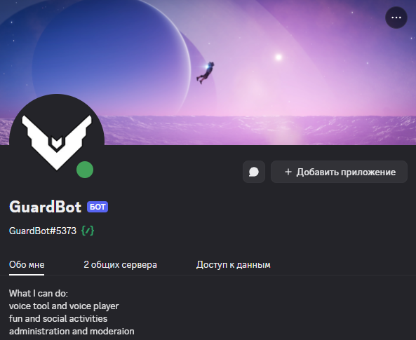

<!-- TOC -->

* [ GuardBot - discord bot](#img-altlogo-height30-srcassetsguardbotlogopng-guardbot---discord-bot)
    * [@GuardBot#5373 | @GuardBot-dev#7721](#guardbot5373--guardbot-dev7721)
        * [`Список изменений`](#список-изменений)
            * [`фиксы`](#фиксы)
        * [`Описание`](#описание)
            * [`Функционал и планы`](#функционал-и-планы)
                * [Script Engine `(IN PROGRESS)`](#script-engine-in-progress)
                * [Voice commands `(PARTIAL FINISHED)`](#voice-commands-partial-finished)
                * [Администрирование:  `(STARTED)`](#администрирование-started)
                * [Социальные активности:  `(NOT STARTED)`](#социальные-активности-not-started)
            * [`BOTDEV команды`](#botdev-команды)
                * [`/botdev_hub`](#botdev_hub)
                * [`/logs`](#logs)
                * [`/script_hub`](#script_hub)

<!-- TOC -->

## `Список изменений`

1) деление релиз бота и бота для разработки, теперь их 2е
2) работа с докером
3) первый деплой на сервер
4) попытки сделать автодеплой на сервер

### `фиксы`

- адаптация путей под Linux,
- улучшенная работа с ключами Discord API, что и позволило создать 2 аккаунта для ботов и задеплоит релизного на сервер

## `Описание`

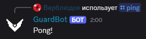\
Это частный дискорд бот поддерживающий скриптинг и имеющий базу данных, написанную на Tortoise-ORM.\
На данный момент: база данных - SQLite, версия Python - 3.12, версия Discord API - 2.5.*
Большая часть взаимодействий будет реализована через Discord API 2.0, начиная простыми app_commands, привязанными к
профилю бота на сервере и заканчивая тотальным переносом всего на discoed.ui, что должно улучшить работу с ботом

### `Функционал и планы`

В этой главе я обозначил список уже имеющихся функций, планируемых и тех, что сейчас находятся в разработке

#### [Script Engine](bot/cogs/script_engine/script_engine.py) `(IN PROGRESS)`

Скрипты позволяют легко настроить поведение бота как для всех серверов, так и для определённого сервера, позволяя
полностью сменить логику или создать свою.\

В данный момент идёт работа над: увеличением безопасности скриптов для сервера и возможности создавать скрипты
привязанные к определённому серверу.\

1. [x] скрипты событий;
2. [x] библиотеки и вызываемые скрипты;
3. [x] система выполнения скриптов из discord;
4. [x] база данных;
5. [x] guild_only скрипты;
6. [x] абстрагирование скриптов от основной программы;
7. [x] отделение зоны видимости скриптов от программы;
8. [ ] улучшение безопасности использования `Discord API` в скриптах;

#### [Voice commands](bot/cogs/voice.py) `(PARTIAL FINISHED)`

Это простые команды голосовых каналов, позволяющие создать динамический, временный канал, позвать туда бота и
попросить проиграть какое-то видео с `YouTube`.\

В данный момент идёт работа над: настройками создания временных каналов как для админа (добавление нового или его
удаление), так и для пользователя, создающего его (например настраиваемое имя канала).\

- Для воспроизведения аудио:  `(FINISHED)`
    1. [x] основные, для работы с каналами;
    2. [x] простое воспроизведение аудио;
    3. [x] очередь воспроизведений;  `(HAS ERRORS)`
- Для оперирования каналами:  `(PARTIAL FINISHED)`
    1. [x] фабрики каналов и временные каналы;
    2. [x] данные пользователя, фабричных и временных каналов;
    3. [ ] настройки каналов и пользователей;  `(STARTED)`

#### [Администрирование](bot/cogs/moderation.py):  `(STARTED)`

Тут нечего говорить - администрирование сервера это управление каналами, участниками имеющими туда доступ и ролями,
дающими пользователям взаимодействовать с этими каналами. Помимо этого бот сможет позволить легко создавать оповещения
в разные каналы и настраивать стандартные оповещения (по типу создания нового временного канала или входа пользователя
на сервер).\

В данный момент идёт работа над: простейшими командами для управления разными объектами и участниками, помимо этого
ведётся работа над созданием мини API для создания скриптов, что позволит как улучшить стандартные команды, так и
создать `guild_only` скрипты.

- Команды:  `(STARTED)`
    1. [ ] управления каналами;  `(STARTED)`
    2. [ ] управления ролями;
    3. [ ] управления участниками;  `(STARTED)`
    4. [ ] API для добавления кастомных команд в `guild_only` cogs;  `(STARTED)`
- Функции:  `(NOT STARTED)`
    1. [ ] оповещения;
    2. [ ] наказания для участников (привязка к правилам);

#### Социальные активности:  `(NOT STARTED)`

Как по моему мнению - дискорд это самая социально выраженная социальная сеть из всех, начиная от разных каналов(чатов)
и серверов(сообществ/каналов), заканчивая делениями на разные социальные статусы, которые тут реализованы ролями. Я
хочу помочь администрации и не только ей улучшить автоматизировать все эти аспекты, позволяя создавать оповещения или
автоматически выдавать роль в зависимости от ранга пользователя или его достижений на сервере.\

Сейчас работа не начата совсем, но в скоре планируется начать с достижений и оповещений.\

1. [ ] уровни;
2. [ ] оповещения;
3. [ ] достижения;
4. [ ] события;

### `BOTDEV команды`

Помимо этого бот имеет огрмный пул команд для сложных взаимодействий с ним. Все команды из этого списка доступны лишь
определённому списку пользователей и в большинстве своём не отображаются в чате. Вот сами команды и их описание:

#### `/botdev_hub`

Запускает [меню прямого управления ботом](bot/cogs/bothub.py), в большей части связанного с [классом бота](bot/bot.py)

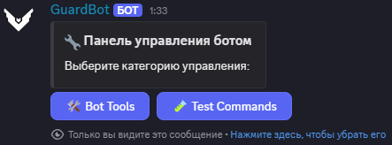

- `bottools` прямые приказы боту, связанные с [его работой](bot/cogs/bottool.py)\
  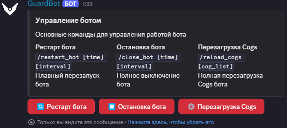
    - хотрелоад бота - `/restart_bot [time] [interval]`
    - остановка работы - `/close_bot [time] [interval]`
    - хотрелоад cogs - `/reload_cogs [cog_list]`
    -
- `test_tools` команды для [тестирования](bot/cogs/test_tools.py), пока что реализованы только проверки
  работоспособности отлова ошибок\
  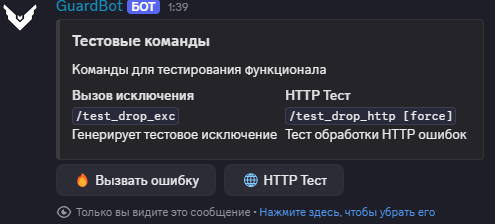
    - простая ошибка `Exception("TEST ERROR")` - `/test_drop_exc`
    - проверка отлова ошибок HTTP (`HTTP 400`), - `/test_drop_http [force]`

#### `/log_hub`

Команда для работы с [лог-системой](bot/cogs/logging.py)

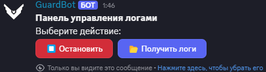

- кнопка `остановить` динамически меняется, в зависимости от текущего статуса логирования - `/turn_logging`
- `получить логи` выдаёт имеющийся список логов - `/get_logs`\
  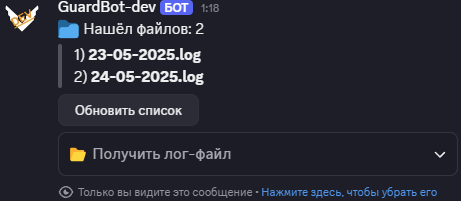

#### `/script_hub [is_light]`

команда для взаимодействия со [скрипт-движком](bot/cogs/script.py). Делится на 2 - панель разработчика и админа сервера.
Первая не поменялась, а вторая немного изменённая его версия.

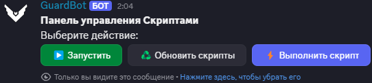

- `запустить` динамически меняется в зависимости от режима выполнения, сам режим выполнения позволяет выполнять
  скрипты прямо из сообщения в дискорд - `/turn_exec_mode`
- `обновить скрипты` - обновляет скрипты, перезагружая их либо с базы данных, либо с файлов -
  `/update_scripts [from_db]`
- `выполнить скрипт` - выполняет скрипт с заданными параметрами - `/exec_script [name] [kwargs] [from_db]`

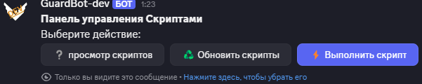

- `просмотр скриптов` - позволяет просмотреть скрипты из базы данных исходя из фильтров, для каждого скрипта выдаёт
  Embed с заголовком и тремя полями - именований, статуса и типа, помимо этого, выдаёт 3 файла, 2 когда (raw & compiled)
  и ещё один с env, что позволяет сделать необходимые действия.\
  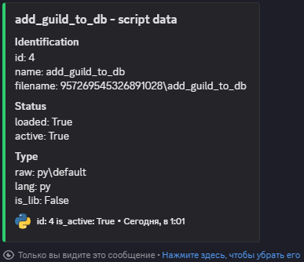\
  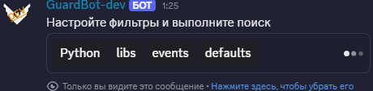
- `обновить скрипты` - обновляет guild only скрипты
- `выполнить скрипт` - работает аналогично кнопке из меню скриптов разработчиков, что тоже помогает в работе со
  скриптами